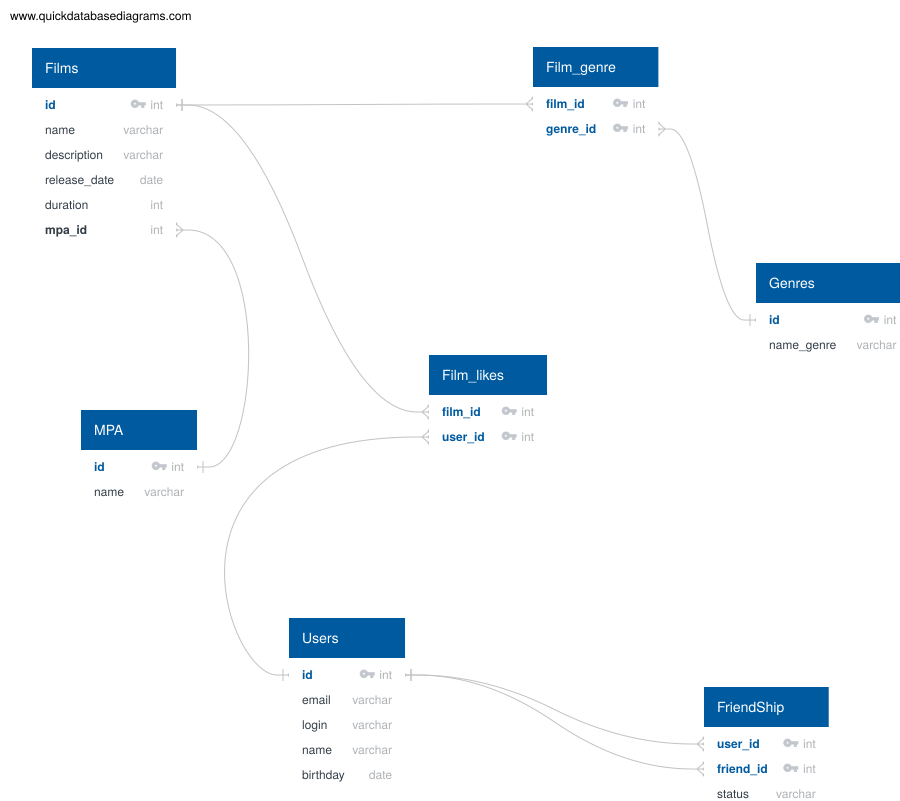

# java-filmorate
Template repository for Filmorate project.



Схема базы данных спроектирована для реализации основных операций приложения:
хранение пользователей и фильмов, выборка топ-фильмов и получение данных по связям между таблицами.
### Примеры запросов

Получение всех фильмов:
```sql
SELECT *
FROM FILMS;
```

Получить фильм по идентификатору:
```sql
SELECT *
FROM FILMS
WHERE ID = 1;
```

Получение фильма и его жанров:
```sql
SELECT F.*, G.NAME_GENRE
FROM FILMS F
JOIN FILM_GENRE FG
ON F.ID = FG.FILM_ID
JOIN GENRES G
ON FG.GENRE_ID = G.ID
WHERE F.ID = 1;
```

Получение фильма и его рейтинга:
```sql
SELECT F.*, M.NAME
FROM FILMS F
JOIN MPA M
ON F.MPA_ID = M.ID;
```

Получение всех пользователей:
```sql
SELECT *
FROM USERS;
```

Получение пользователя по идентификатору:
```sql
SELECT *
FROM USERS
WHERE ID = 1;
```

Получение информации по пользователю и идентификаторов его друзей:
```sql
SELECT U.*, F.FRIEND_ID
FROM USERS U
JOIN FRIENDSHIP F
ON U.ID = F.USER_ID
WHERE U.ID = 1;
```

